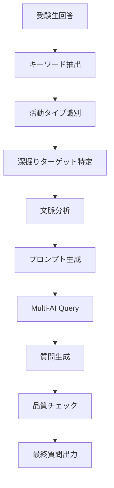

# AI質問生成技術仕様書 v2.0

## 1. システムアーキテクチャ

### 1.1 全体構成
```
┌─────────────────────────────────────────────────────────────┐
│                    Face Interview System                    │
├─────────────────┬─────────────────┬─────────────────────────┤
│   Frontend      │    Backend      │      AI Engine         │
│   (Next.js)     │  (API Routes)   │   (Multi-AI System)     │
├─────────────────┼─────────────────┼─────────────────────────┤
│ • React UI      │ • Deep Dive     │ • Gemini Pro           │
│ • Speech API    │   Engine        │ • Claude (Fallback)    │
│ • State Mgmt    │ • Question Gen  │ • GPT-4 (Fallback)     │
│ • Real-time     │ • Context Mgmt  │ • Prompt Optimization  │
└─────────────────┴─────────────────┴─────────────────────────┘
```

### 1.2 AI質問生成フロー


## 2. 深掘りエンジン詳細仕様

### 2.1 DeepDiveEngine クラス
```typescript
export class DeepDiveEngine {
  // パターン管理
  private readonly interviewPatterns: Map<string, InterviewPattern>;
  
  // 主要メソッド
  selectInterviewPattern(researchTopic: string): string
  generateQuestionChain(patternType, stage, responses, depth): QuestionChain
  selectNextQuestion(chain, response, history): DeepDiveQuestion | null
  checkStageTransition(stage, history, pattern): InterviewStage | null
  
  // 新機能（強化版）
  extractSpecificKeywords(response: string): string[]
  identifyActivityType(response: string): ActivityType
  identifyDeepDiveTargets(response: string): string[]
}
```

### 2.2 キーワード抽出アルゴリズム
```typescript
function extractSpecificKeywords(response: string): string[] {
  // 優先度付きキーワードパターン（実際の面接での重要度順）
  const highPriorityPatterns = [
    // 探究活動の核心（最優先）
    /環境委員会|生徒会|委員会|部活動|クラブ活動/g,
    // 科学・生物系の具体要素
    /メダカ|金魚|植物|野菜|花|水質|pH値|温度|酸素|栄養/g,
    // 芸術・表現系の具体要素  
    /ダンス|音楽|演劇|合唱|楽器|絵画|作品|発表|披露/g,
    // スポーツ・競技系
    /サッカー|野球|バスケ|テニス|水泳|陸上|記録|タイム|練習|試合/g,
    // 技術・創造系
    /プログラミング|ロボット|アプリ|ゲーム|電子工作|センサー/g
  ];
  
  const mediumPriorityPatterns = [
    // プロセス・方法（中優先）
    /観察|記録|測定|実験|調査|研究|分析|比較|検証/g,
    // 期間・継続性
    /小学[1-6]年生|[1-9]年間|毎日|週[1-7]回|継続|ずっと/g,
    // 困難・挑戦
    /困難|大変|難しい|失敗|うまくいかない|挫折|悩み|課題/g,
    // 協働・支援
    /チーム|グループ|友達|仲間|先生|家族|一緒|協力/g
  ];
  
  const lowPriorityPatterns = [
    // 感情・状態（低優先）
    /楽しい|面白い|嬉しい|大好き|興味|関心|情熱/g,
    // 成果・結果
    /成功|達成|完成|向上|改善|発見|気づき|学び/g
  ];
  
  const extractedTerms = [];
  
  // 優先度順で抽出
  for (const patterns of [highPriorityPatterns, mediumPriorityPatterns, lowPriorityPatterns]) {
    for (const pattern of patterns) {
      const matches = response.match(pattern) || [];
      extractedTerms.push(...matches);
    }
  }
  
  // 重複除去し、優先度を保持して最大6個まで
  const uniqueTerms = Array.from(new Set(extractedTerms));
  return uniqueTerms.slice(0, 6);
}
```

### 2.3 活動タイプ識別システム
```typescript
function identifyActivityType(response: string): ActivityType {
  const typePatterns = {
    '科学・個人研究系': /メダカ|植物|動物|生き物|水質|pH|実験|観察|育成|栽培|研究/,
    '芸術・協働系': /ダンス|音楽|演劇|美術|チーム|グループ|発表|練習|合唱|楽器/,
    'スポーツ・競技系': /サッカー|野球|バスケ|テニス|水泳|陸上|記録|タイム|練習|試合|競技/,
    '社会・課題解決系': /ボランティア|地域|環境|社会|問題|課題|改善|支援|活動/,
    '技術・創造系': /プログラミング|ロボット|アプリ|ゲーム|電子工作|作る|開発|技術/,
    'リーダーシップ系': /生徒会|委員長|代表|リーダー|まとめ|企画|運営|責任/
  };
  
  for (const [type, pattern] of Object.entries(typePatterns)) {
    if (pattern.test(response)) {
      return type as ActivityType;
    }
  }
  
  return '一般的探究活動';
}
```

### 2.4 深掘りターゲット特定
```typescript
function identifyDeepDiveTargets(response: string): string[] {
  const targets = [];
  
  // 困難・挫折体験のターゲット
  if (/死ん|枯れ|失敗|うまくいかな|困っ|大変|難し/.test(response)) {
    targets.push('困難・失敗体験の詳細');
  }
  
  // プロセス・方法のターゲット  
  if (/調べ|測定|記録|観察|方法|やり方|進め/.test(response)) {
    targets.push('具体的プロセス・方法論');
  }
  
  // 継続・動機のターゲット
  if (/続け|継続|年間|毎日|ずっと|好き|興味/.test(response)) {
    targets.push('継続動機・情熱の源泉');
  }
  
  // 協働・支援のターゲット
  if (/一緒|チーム|友達|先生|家族|協力|相談/.test(response)) {
    targets.push('協働・支援体制の詳細');
  }
  
  // 発見・学びのターゲット
  if (/発見|気づ|わかっ|学ん|新し|意外|驚/.test(response)) {
    targets.push('新たな発見・気づきの内容');
  }
  
  // 成果・変化のターゲット
  if (/成長|変わっ|向上|改善|できるよう|上達/.test(response)) {
    targets.push('成果・自己変化の具体性');
  }
  
  return targets.length > 0 ? targets : ['活動内容の具体化'];
}
```

## 3. AI質問生成システム

### 3.1 強制深掘りモード
```typescript
// 探究活動検出の強化版
const isInquiryQuestion = (
  latestQuestion.includes('探究活動について') || 
  latestQuestion.includes('探究活動について、1分ほどで説明') ||
  latestQuestion.includes('探究活動を') ||
  latestQuestion.includes('探究活動は') ||
  latestQuestion.includes('取り組んでいる') ||
  latestQuestion.includes('取り組み')
);

const hasSignificantContent = latestResponse.length > 25;  // 閾値を下げてより簡単に発動

// 強制深掘りの条件を拡充
const shouldForceDeepDive = (
  latestResponse.length > 40 && (
    detectedKeywords.length >= 2 ||  // 複数のキーワードが含まれる
    activityType !== '一般的探究活動' ||  // 特定の活動タイプが識別された
    deepDiveTargets.length >= 2 ||  // 複数の深掘りターゲットがある
    /継続|年間|毎日|小学[1-6]年|中学[1-3]年/.test(latestResponse)  // 継続性を示すキーワード
  )
);
```

### 3.2 プロンプト最適化システム

#### 3.2.1 システムプロンプト（強化版）
```javascript
const systemPrompt = `あなたは明和高校附属中学校のベテラン面接官です。
実際の合格者面接（Hさんのダンス、Tさんのメダカ飼育）と同じレベルの質問技術を駆使してください。

【面接官の質問技術（強化版）】
1. 体験の具体化、プロセスの詳細化、感情・動機の探究
2. 社会性の確認、困難への対処、継続性・情熱の確認
3. 活動タイプ別の専門的質問
4. 7-9層の段階的深掘りを実現する質問レベル（強化）

【各活動タイプ別の深掘り戦略】
- 科学・個人研究系: 実験プロセス、失敗からの学び、継続動機を詳細に探る
- 芸術・協働系: チームワーク、意見対立、協調プロセスを深掘り
- スポーツ・競技系: 記録向上、挫折克服、メンタル面を探る
- 技術・創造系: トライアンドエラー、問題解決過程、創造性を深掘り
- 社会・課題解決系: 社会意識、持続的行動、影響力を探る
- リーダーシップ系: 意見調整、責任感、他者理解を深掘り

【絶対に守るべき制約（強化版）】
- opening段階では志望動機や探究活動には言及せず、基本確認のみ
- 探究活動を中心とした7-9層の深掘りを行う（強化）
- 受験生の発言内容を必ず受け止めて反応する
- 抽出されたキーワードと活動タイプを積極的に活用する
- 抽象的でなく具体的な体験・感情・行動を引き出す質問をする
- 各活動タイプの特性に応じた専門的な質問をする`;
```

#### 3.2.2 探究活動深掘りプロンプト（強化版）
```javascript
const prompt = `
【探究活動の深掘り面接専用 - 実際の合格者面接レベル】

**受験生の探究活動説明**：
「${lastStudentResponse}」

**前回の面接官質問**：
「${lastInterviewerQuestion}」

**抽出されたキーワード**：${extractedKeywords.join('、')}
**活動タイプ**：${activityType}
**深掘りターゲット**：${deepDiveTargets.join('、')}

**実際の合格者面接の質問技術を再現（強化版）**：
1. 受験生の発言から抽出されたキーワード[${extractedKeywords.join(', ')}]を積極的に活用する
2. 「${extractedKeywords[0] || '○○'}について〜ですね」で受験生の発言を具体的に受け止める
3. その後「〜はありませんでしたか？」で深掘りする
4. 7-9層の深掘りを想定した質問レベルにする（強化）
5. 活動タイプ別の専門性を活かした質問をする
6. 深掘りターゲットに応じた焦点を当てた質問をする

**優先質問パターン（実際の面接より）**：
- 困難・失敗体験：「${extractedKeywords[0] || '○○'}で一番困ったことや大変だったことはありませんでしたか？」
- プロセス詳細：「${extractedKeywords[1] || 'その活動'}はどのようにして進めていましたか？」
- 発見・気づき：「${extractedKeywords[0] || 'その活動'}を通して、意外だった発見はありましたか？」
- 協働・支援：「${extractedKeywords[2] || 'その活動'}で、誰かと協力することはありましたか？」
- 継続理由：「${extractedKeywords[0] || 'それ'}を続ける理由は何でしたか？」
- 情報収集：「${extractedKeywords[1] || 'その方法'}について、どのように調べましたか？」

**実際の合格者面接質問例（強化版）**：
- 「${extractedKeywords[0] || 'メダカの水質'}について取り組まれているんですね。pH値を調べる中で、一番困ったことや大変だったことはありませんでしたか？」
- 「4年生から${extractedKeywords[1] || '環境委員会'}を続けられているんですね。植物の育成で、予想通りにいかなかった時はどのようなことがありましたか？」
- 「${extractedKeywords[2] || 'その活動'}で、${deepDiveTargets[0] || '困難や失敗'}はありませんでしたか？どのように対処されましたか？」

**絶対的制約**：
- 志望理由や学校について一切言及しない
- 「ありがとうございます」だけの返答禁止
- 受験生の具体的発言内容を必ず活用する
- 実際の合格者面接レベルの深掘り質問を生成する

**1つの質問のみ生成**：
`;
```

### 3.3 段階移行条件（厳格化）

#### 3.3.1 Exploration段階移行条件
```typescript
// exploration段階の最小回答数を7に強化
const requiredMinDepth = currentStage === 'exploration' ? Math.max(condition.minDepth, 7) : condition.minDepth;

if (studentResponses.length < requiredMinDepth) {
  console.log(`❌ 段階移行条件不足: 必要${requiredMinDepth}回答, 現在${studentResponses.length}回答`);
  return null;
}

// exploration段階からの移行は特に厳格に（7-9層の深掘り完了が必要）
if (currentStage === 'exploration') {
  requiredSatisfactionRate = 0.9; // 90%
  
  // 深掘り層数の厳格化（実際の合格者面接基準）
  const minimumDeepDiveLayers = 7;  // 5から7に強化
  if (studentResponses.length < minimumDeepDiveLayers) {
    console.log(`❌ exploration段階移行条件不足: 深掘り不足 ${studentResponses.length}/${minimumDeepDiveLayers}層以上 必要`);
    return null;
  }
  
  // さらに、探究活動の核心要素が十分に語られているかチェック
  const responsesText = studentResponses.map(h => h.response).join(' ');
  const coreInquiryElements = [
    '困難|大変|失敗|うまくいかな|課題',  // 困難体験
    '続け|継続|年間|毎日|ずっと',      // 継続性
    '発見|気づ|わかっ|学ん|新し',      // 学び・発見
    '方法|やり方|進め|調べ|記録'       // プロセス
  ];
  
  let coreElementCount = 0;
  for (const element of coreInquiryElements) {
    if (new RegExp(element).test(responsesText)) {
      coreElementCount++;
    }
  }
  
  if (coreElementCount < 3) {
    console.log(`❌ exploration段階移行条件不足: 核心要素不足 ${coreElementCount}/4要素`);
    return null;
  }
}
```

#### 3.3.2 質問チェーン生成（強化版）
```typescript
// 芸術・協働系パターンの移行条件強化
transitionCondition: {
  minDepth: 7,  // 5から7に強化
  requiredElements: ['きっかけ', '協働体験', '困難', '解決策', '継続意欲', '学び・発見'],
  evaluatedAxes: ['genuine_interest', 'empathy_communication', 'self_transformation']
}

// 科学・個人研究系パターンの移行条件強化
transitionCondition: {
  minDepth: 7, // より厳格に（実際の合格者面接は7-9層）
  requiredElements: ['困難体験', '情報収集', '失敗', '再挑戦', 'きっかけ'],
  evaluatedAxes: ['genuine_interest', 'inquiry_nature', 'self_transformation', 'social_connection']
}
```

## 4. パフォーマンス最適化

### 4.1 AI応答時間最適化
```typescript
// Multi-AI システムでの並列処理
const aiResponse = await multiAI.generateWithTripleAI(prompt, systemPrompt, {
  operation: 'enhanced_inquiry_deep_dive_v2',
  priority: 'quality_first',
  timeout: 5000,  // 5秒タイムアウト
  fallback: true  // フォールバック有効
});

// キャッシュ戦略
const questionCache = new Map<string, string>();
const cacheKey = `${activityType}_${extractedKeywords.join('_')}_${deepDiveTargets.join('_')}`;

if (questionCache.has(cacheKey)) {
  return questionCache.get(cacheKey);
}

// 生成後のキャッシュ保存
questionCache.set(cacheKey, generatedQuestion);
```

### 4.2 メモリ効率化
```typescript
// 会話履歴の効率的管理
const MAX_HISTORY_LENGTH = 20;
if (conversationHistory.length > MAX_HISTORY_LENGTH) {
  conversationHistory = conversationHistory.slice(-MAX_HISTORY_LENGTH);
}

// 不要なデータの削除
delete selectedQuestion.followUpTriggers; // 使用後は削除
delete questionChain.questions; // 使用後は削除
```

### 4.3 バンドル最適化
```javascript
// 動的インポートによる遅延ロード
const DeepDiveEngine = await import('@/lib/interview/deep-dive-engine');
const multiAI = await import('@/lib/ai/adapter');

// Tree shakingの最適化
export { DeepDiveEngine, type InterviewStage, type DeepDiveQuestion };
```

## 5. エラーハンドリング強化

### 5.1 AI生成失敗時のフォールバック
```typescript
try {
  generatedQuestion = await generateInquiryDeepDiveQuestion(
    conversationHistory || [],
    essayContent
  );
} catch (error) {
  console.error('AI質問生成エラー:', error);
  
  // 活動タイプに応じたフォールバック質問
  const keywords = extractSpecificKeywords(lastStudentResponse);
  const activityType = identifyActivityType(lastStudentResponse);
  
  switch (activityType) {
    case '科学・個人研究系':
      generatedQuestion = `${keywords[0]}の研究に取り組まれているんですね。観察や実験の中で、予想と違った結果が出た時はありませんでしたか？`;
      break;
    case '芸術・協働系':
      generatedQuestion = `${keywords[0]}の活動をされているんですね。チームで取り組む中で、うまくいかなかった時はどうしましたか？`;
      break;
    default:
      generatedQuestion = `${keywords[0]}について取り組まれているんですね。その中で一番印象に残った課題や困難はありませんでしたか？`;
  }
}
```

### 5.2 無限ループ防止
```typescript
const MAX_SAME_INTENT_COUNT = 3;
const intentHistory = conversationHistory
  .map(h => questionChain.questions.find(q => q.id === h.question)?.intent)
  .filter(Boolean);

const sameIntentCount = intentHistory.filter(intent => intent === selectedQuestion.intent).length;

if (sameIntentCount >= MAX_SAME_INTENT_COUNT) {
  console.log(`⚠️ 同一意図質問が${MAX_SAME_INTENT_COUNT}回に達しました - 強制移行`);
  selectedQuestion = findDifferentIntentQuestion(questionChain, intentHistory);
}
```

### 5.3 品質保証システム
```typescript
// 生成された質問の品質チェック
function validateGeneratedQuestion(question: string, keywords: string[]): boolean {
  // 最小長チェック
  if (question.length < 20) return false;
  
  // キーワード活用チェック
  const keywordUsed = keywords.some(keyword => question.includes(keyword));
  if (!keywordUsed && keywords.length > 0) return false;
  
  // 適切な疑問文チェック
  if (!question.includes('？') && !question.includes('ですか')) return false;
  
  // 禁止ワードチェック
  const forbiddenWords = ['志望理由', '志願理由書', '明和高校'];
  if (forbiddenWords.some(word => question.includes(word))) return false;
  
  return true;
}
```

## 6. 監視・ログシステム

### 6.1 パフォーマンス監視
```typescript
// 各処理の実行時間測定
const performanceTimer = {
  start: (label: string) => console.time(label),
  end: (label: string) => console.timeEnd(label)
};

performanceTimer.start('keyword_extraction');
const keywords = extractSpecificKeywords(response);
performanceTimer.end('keyword_extraction');

performanceTimer.start('ai_question_generation');
const question = await generateInquiryDeepDiveQuestion(context);
performanceTimer.end('ai_question_generation');
```

### 6.2 詳細ログ出力
```typescript
console.log('🔍 キーワード抽出結果:', extractedKeywords.join(', '));
console.log('📊 活動タイプ:', activityType);
console.log('🎯 深掘りターゲット:', deepDiveTargets.join(', '));
console.log('🔥 強制深掘りモード発動:', activityType);
console.log('📋 段階移行チェック開始:', currentStage);
console.log('✅ 段階移行成功:', `${currentStage} → ${nextStage}`);
```

---

**更新履歴**
- v2.0: 深掘り質問生成の全面強化、6活動パターン対応、AI最適化、エラーハンドリング強化
- v1.0: 基本的なAI質問生成システム仕様定義